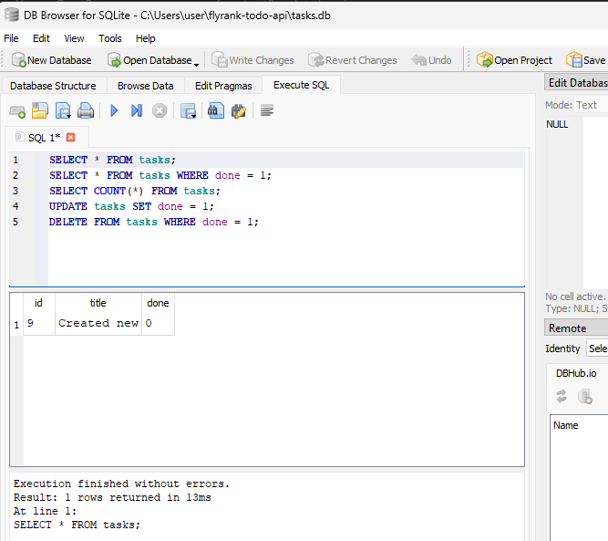

# Task API

A simple CRUD REST API for managing tasks, built with Express and SQLite. Each task has an `id`, a `title`, a `done` status, and timestamps. The API is fully documented with Swagger UI.

---

## Features

- List all tasks (with search, filter, and sort)
- Get a single task by ID
- Create a new task
- Update an existing task (title and completion status)
- Delete a task
- Statistics endpoint
- Health check endpoint
- Interactive API documentation via Swagger UI
- Persistent SQLite storage (zero setup — auto-created on first run)
- Task IDs reset to 1 when the table is emptied

---

## Technologies Used

- **Node.js** — JavaScript runtime
- **Express 5** — Web framework
- **node:sqlite** — Built-in SQLite (Node 22+, no extra install)
- **Swagger UI Express** — Interactive API docs

---

## Getting Started

### Prerequisites

- [Node.js](https://nodejs.org/) v22 or later (built-in SQLite support)

### One command to start

```bash
git clone <repository-url>
cd flyrank-todo-api
npm install
npm start
```

The API will be available at **http://localhost:3000**. The `tasks.db` file is created automatically on first run with three seeded tasks — no manual setup needed.

> Use `npm run dev` during development for auto-restart via nodemon.

---

## API Endpoints

| Method   | Endpoint                 | Description                    |
|----------|--------------------------|--------------------------------|
| `GET`    | `/`                      | API information                |
| `GET`    | `/health`                | Health check                   |
| `GET`    | `/tasks`                 | List all tasks                 |
| `GET`    | `/tasks?search=keyword`  | Search tasks by title          |
| `GET`    | `/tasks?done=true`       | Filter by completion status    |
| `GET`    | `/tasks?sort=title`      | Sort tasks alphabetically      |
| `GET`    | `/tasks/:id`             | Get a task by ID               |
| `GET`    | `/stats`                 | Get task statistics            |
| `POST`   | `/tasks`                 | Create a new task              |
| `PUT`    | `/tasks/:id`             | Update a task                  |
| `DELETE` | `/tasks/:id`             | Delete a task                  |

Query parameters on `GET /tasks` can be combined (e.g. `/tasks?search=milk&done=false&sort=title`).

### Example Requests & Responses

#### List all tasks

```bash
curl http://localhost:3000/tasks
```

```json
[
  { "id": 1, "title": "Learn Express", "done": true, "created_at": "2026-07-21 12:00:00", "updated_at": "2026-07-21 12:00:00" },
  { "id": 2, "title": "Build Task API", "done": false, "created_at": "2026-07-21 12:00:00", "updated_at": "2026-07-21 12:00:00" },
  { "id": 3, "title": "Deploy",         "done": false, "created_at": "2026-07-21 12:00:00", "updated_at": "2026-07-21 12:00:00" }
]
```

#### Search, filter, and sort

```bash
curl "http://localhost:3000/tasks?search=Build&sort=title"
```

#### Statistics

```bash
curl http://localhost:3000/stats
```

```json
{ "total": 3, "completed": 1, "pending": 2 }
```

---

## Swagger Documentation

Interactive API documentation is available at:

**http://localhost:3000/docs**


---

## Project Structure

```
flyrank-todo-api/
├── node_modules/
├── db.js              # SQLite setup and connection
├── index.js           # Express server and route definitions
├── openapi.json       # OpenAPI 3.0 specification
├── package.json
├── package-lock.json
├── tasks.db           # SQLite database (auto-created, git-ignored)
└── README.md
```

---

## A Note on Database Migrations

Adding the `created_at` and `updated_at` columns after the app was already running meant writing migration code to detect the old schema and alter the table. This felt fragile — if another developer had a slightly different version of the database, the migration could fail silently. This is exactly why dedicated migration tools exist: they track which changes have been applied and run them in order, so you never have to guess what shape the database is in.


---

## Future Improvements

- Add pagination to `GET /tasks`
- Add user authentication and authorization
- Add request validation middleware (e.g. Joi or Zod)
- Write automated tests
- Add CORS support
- Containerize with Docker
